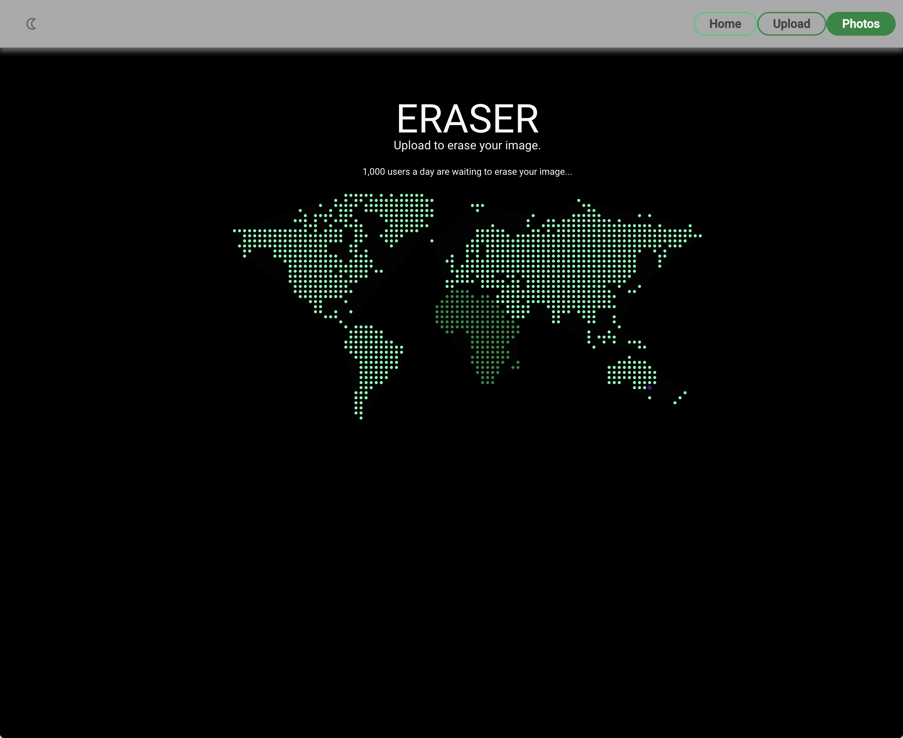

<!-- Improved compatibility of back to top link: See: https://github.com/othneildrew/Best-README-Template/pull/73 -->
<a name="readme-top"></a>


<br />

<h3 align="center">Eraser/Pixly</h3>

  <p align="center">
 Users can upload their photos and apply various edits, including transforming images to black & white and adjusting colors. 
    <br />
</div>


<!-- TABLE OF CONTENTS -->
<details>
  <summary>Table of Contents</summary>
  <ol>
    <li>
      <a href="#about-the-project">About The Project</a>
      <ul>
        <li><a href="#built-with">Built With</a></li>
      </ul>
    </li>
    <li>
      <a href="#getting-started">Getting Started</a>
      <ul>
        <li><a href="#prerequisites">Prerequisites</a></li>
        <li><a href="#installation">Installation</a></li>
      </ul>
    </li>
    <li><a href="#usage">Usage</a></li>
    <li><a href="#contributing">Contributing</a></li>
    <li><a href="#license">License</a></li>
    <li><a href="#contact">Contact</a></li>
    <li><a href="#acknowledgments">Acknowledgments</a></li>
  </ol>
</details>


<!-- ABOUT THE PROJECT -->
## About The Project



Eraser 'Pixly' is a full-stack image editing application built with a React frontend and a Flask/Python backend. Amazon S3 bucket for image storage, replacing images upon editing— whether it's a black & white conversion or color adjustment. With Eraser, repeated color edits on a single image may trigger an "Eraser" action...

<p align="right">(<a href="#readme-top">back to top</a>)</p>


### Built With

* [![React][React.js]][React-url]
* [![Flask][Flask-logo]][Flask-url]
* [![Vite][Vite-logo]][Vite-url]


<p align="right">(<a href="#readme-top">back to top</a>)</p>


<!-- GETTING STARTED -->
## Getting Started

Frontend and backend have different instructions.

### Installation

Frontend:

1. Clone the repo
   ```sh
   git clone https://github.com/eewwalker/ERASER/
   ```
2. Go to Frontend folder
   ```sh
   cd ERASER/pixly-frontend
   ```
3. Install NPM packages
   ```sh
   npm install
   ```
4. Run frontend server (app will automatically load on browser) RUN AFTER COMPLETING BACKEND STEPS..
   ```sh
   npm start
   ```

Backend:

1. Go to Backend folder from root 'ERASER'
   ```sh
    cd ERASER/pixly-backend
   ```
2. Activate Venv
   ```sh
   python3 -m venv venv
   source venv/bin/activate
   ```
3. Install dependencies
   ```sh
   pip install -r requirements.txt
   ```
4. Create an .env file in the root directory of your project and add the necessary env variables. Note: you will need an Amazon S3 bucket to connect (get API KEY there).
   ```sh
   aws_access_key_id = ...
   aws_secret_access_key = ...
   region_name = 'us-west-1'
   SECRET_KEY = ...
   BUCKET_NAME = 'bucket-name'
   DATABASE_URL = postgresql:///pixly
   ```

5. Run backend server 
   ```sh
   flask run -p 5001
   ```
<p align="right">(<a href="#readme-top">back to top</a>)</p>


<!-- USAGE EXAMPLES -->
## Usage

Drag and Drop or upload image.
<br/>
<br/>
<br/>
<br/>

Search for photo in top left search bar or see all photos. Clicking on individual photo takes you to editing
<br/>
<br/>
<br/>
<br/>

Edit your image here. B&W convert, or color edit.
<br/>
<br/>
<br/>

<p align="right">(<a href="#readme-top">back to top</a>)</p>


<!-- LICENSE -->
## License

Distributed under the MIT License. See `LICENSE.txt` for more information.

<p align="right">(<a href="#readme-top">back to top</a>)</p>


<!-- CONTACT -->
## Contact

Project Link: [https://github.com/eewwalker/ERASER](https://github.com/eewwalker/ERASER)

<p align="right">(<a href="#readme-top">back to top</a>)</p>


<!-- ACKNOWLEDGMENTS -->
## Acknowledgments

* Built in collaboration with: [Jazz Chema](https://github.com/jazzcheema)

<p align="right">(<a href="#readme-top">back to top</a>)</p>


<!-- MARKDOWN LINKS & IMAGES -->
<!-- https://www.markdownguide.org/basic-syntax/#reference-style-links -->
[contributors-shield]: https://img.shields.io/github/contributors/github_username/repo_name.svg?style=for-the-badge
[contributors-url]: https://github.com/github_username/repo_name/graphs/contributors
[forks-shield]: https://img.shields.io/github/forks/github_username/repo_name.svg?style=for-the-badge
[forks-url]: https://github.com/github_username/repo_name/network/members
[stars-shield]: https://img.shields.io/github/stars/github_username/repo_name.svg?style=for-the-badge
[stars-url]: https://github.com/github_username/repo_name/stargazers
[issues-shield]: https://img.shields.io/github/issues/github_username/repo_name.svg?style=for-the-badge
[issues-url]: https://github.com/github_username/repo_name/issues
[license-shield]: https://img.shields.io/github/license/github_username/repo_name.svg?style=for-the-badge
[license-url]: https://github.com/github_username/repo_name/blob/master/LICENSE.txt
[linkedin-shield]: https://img.shields.io/badge/-LinkedIn-black.svg?style=for-the-badge&logo=linkedin&colorB=555
[linkedin-url]: https://www.linkedin.com/in/jazz-cheema-294797118/
[product-screenshot]: images/screenshot.png
[Next.js]: https://img.shields.io/badge/next.js-000000?style=for-the-badge&logo=nextdotjs&logoColor=white
[Next-url]: https://nextjs.org/
[React.js]: https://img.shields.io/badge/React-20232A?style=for-the-badge&logo=react&logoColor=61DAFB
[React-url]: https://reactjs.org/
[Vue.js]: https://img.shields.io/badge/Vue.js-35495E?style=for-the-badge&logo=vuedotjs&logoColor=4FC08D
[Vue-url]: https://vuejs.org/
[Angular.io]: https://img.shields.io/badge/Angular-DD0031?style=for-the-badge&logo=angular&logoColor=white
[Angular-url]: https://angular.io/
[Svelte.dev]: https://img.shields.io/badge/Svelte-4A4A55?style=for-the-badge&logo=svelte&logoColor=FF3E00
[Svelte-url]: https://svelte.dev/
[Laravel.com]: https://img.shields.io/badge/Laravel-FF2D20?style=for-the-badge&logo=laravel&logoColor=white
[Laravel-url]: https://laravel.com
[Bootstrap.com]: https://img.shields.io/badge/Bootstrap-563D7C?style=for-the-badge&logo=bootstrap&logoColor=white
[Bootstrap-url]: https://getbootstrap.com
[JQuery.com]: https://img.shields.io/badge/jQuery-0769AD?style=for-the-badge&logo=jquery&logoColor=white
[JQuery-url]: https://jquery.com
[Flask-logo]: https://img.shields.io/badge/Flask-000000?style=for-the-badge&logo=flask&logoColor=white
[Flask-url]: https://flask.palletsprojects.com/
[Vite-url]: https://vitejs.dev/
[Vite-logo]: https://img.shields.io/badge/vite-%23646CFF.svg?style=for-the-badge&logo=vite&logoColor=white
